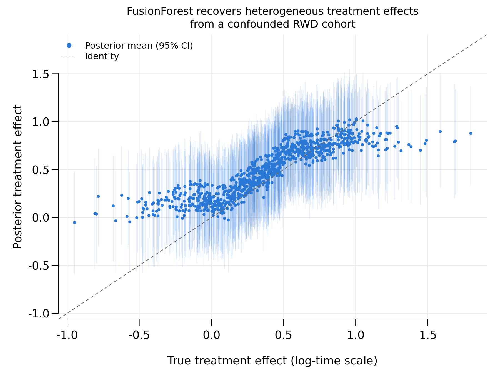

# FusionForests = 3.5"> 


**FusionForests** is an R package for Bayesian tree ensemble models for
**data fusion** and **causal inference**. The main model,
`FusionForest()`, combines data from a randomised controlled trial (RCT)
and an observational study (real-world data, RWD) in a single Bayesian
framework. Crucially, the observational data are **not** assumed to be
unconfounded.

The model targets heterogeneous treatment effects on continuous and
(interval-)censored survival outcomes. Using an accelerated failure
time specification, the outcome is decomposed over separate tree
forests:

$$\log T = m_0(X) + (1-S)\,d(X) + A\,\tau(X) + (1-S)\,A\,c(X) + \varepsilon,$$

where $T$ is the survival time (for a continuous outcome, $\log T$ is
replaced by the outcome itself), $A$ is the treatment, $S$ indicates
the source ($S = 1$ for the RCT, $S = 0$ for the RWD), and
$\varepsilon$ is a mean-zero error term — Gaussian or a flexible
Dirichlet-process mixture. Each term is modelled by its own forest:

- $m_0(X)$ — **baseline forest**: the baseline log survival time under
  control, shared across both sources (`control` arguments);
- $d(X)$ — **deviation forest**: how the baseline in the RWD deviates
  from the one in the RCT (`deviation` arguments);
- $\tau(X)$ — **treatment forest**: the heterogeneous treatment effect
  (`treat` arguments);
- $c(X)$ — **confounding forest**: the bias in the RWD treatment
  contrast caused by unmeasured confounding (`deconf` arguments).

The real-world data alone identify only the sum $\tau(x) + c(x)$. The
trial anchors $\tau$, so the observational data add precision without
their confounding leaking into the treatment effect estimate.

## Reference

The methodology is described in:

> _Bayesian fusion forests for heterogeneous treatment effects on survival from randomised and real-world data_
> T. Jacobs, S.L. van der Pas, W.N. van Wieringen
> https://arxiv.org/abs/2607.29295

## Installation

The development version can be installed from GitHub:

```r
# install.packages("remotes")
remotes::install_github("tijn-jacobs/FusionForests")
```

## Quick example

A small RCT (n = 200) is combined with a larger RWD cohort (n = 800)
in which treatment assignment depends on an **unobserved confounder**
`U` that also affects survival:

```r
library(FusionForests)

set.seed(42)
n_rct <- 200
n_rwd <- 800
n <- n_rct + n_rwd

X <- matrix(rnorm(n * 3), n, 3)
U <- rnorm(n)                        # unobserved confounder
s <- rep(c(1, 0), c(n_rct, n_rwd))   # 1 = RCT, 0 = RWD

# Treatment: randomised in the RCT, driven by U in the RWD
a <- ifelse(s == 1,
            rbinom(n, 1, 0.5),
            rbinom(n, 1, plogis(1.5 * U)))

# True heterogeneous effect on log survival time
tau <- 0.4 + 0.4 * X[, 1]

log_t <- 1 + X[, 1] + 0.5 * X[, 2] + a * tau + 0.7 * U + 0.3 * rnorm(n)
true_time <- exp(log_t)
cens_time <- rexp(n, rate = 1 / (2 * mean(true_time)))
time   <- pmin(true_time, cens_time)
status <- as.integer(true_time <= cens_time)

fit <- FusionForest(
  y = time, status = status,
  X_train_control = X, X_train_treat = X,
  treatment_indicator_train = a, source_indicator_train = s,
  X_test_control = X, X_test_treat = X,
  treatment_indicator_test = a, source_indicator_test = s,
  outcome_type = "right-censored",
  N_post = 2000, N_burn = 2000,
  store_posterior_sample = TRUE
)

# Posterior draws of the treatment effect (log-time scale) per subject
cate <- log(fusion_estimand(fit, estimand = "AF"))
cate_mean <- colMeans(cate)
cate_lo   <- apply(cate, 2, quantile, 0.025)
cate_hi   <- apply(cate, 2, quantile, 0.975)

plot(tau, cate_mean, pch = 19, cex = 0.45, col = "#2a78d6",
     xlab = "True treatment effect (log-time scale)",
     ylab = "Posterior treatment effect")
segments(tau, cate_lo, tau, cate_hi, col = adjustcolor("#2a78d6", 0.12))
abline(0, 1, lty = 2, col = "grey40")
```



Even though treatment assignment in the RWD is driven by an unobserved
confounder, the fitted treatment effects track the truth (correlation
0.89) and the 95% credible intervals cover the true effect for 94% of
subjects.

## The FusionForest model

`FusionForest()` is the heart of the package. It fits the decomposition
above with standard BART priors on each forest and returns posterior
draws of every component, so treatment effects, source deviations and
uncertainty are all available directly from one fit. Right-censored and
interval-censored survival outcomes are handled through data
augmentation, and the error distribution can be Gaussian or a
Dirichlet-process mixture (`error_dist`) for added robustness.

Two companion functions summarise a fit: `fusion_estimand()` returns
posterior draws of causal survival estimands (survival difference,
acceleration factor), and `fusion_projection()` projects the treatment
effect surface onto an interpretable linear basis.

The single-study causal and survival models from the
[ShrinkageTrees](https://cran.r-project.org/package=ShrinkageTrees)
package are re-exported, so `library(FusionForests)` provides every
model from the accompanying paper in one namespace.

## License

[MIT License](https://cran.r-project.org/web/licenses/MIT)

## Funding

This project has received funding from the European Research Council (ERC) under the European Union’s Horizon Europe program under Grant agreement No. 101074802. Views and opinions expressed are however those of the author(s) only and do not necessarily reflect those of the European Union or the European Research Council Executive Agency. Neither the European Union nor the granting authority can be held responsible for them. This work used the Dutch national e-infrastructure with the support of the SURF Cooperative using grant no. EINF-18803.
